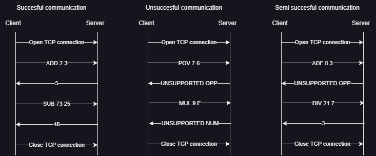

# Protocol Specification

## Overview

The goal of this protocol is to enable communication between a client and a server. It will allow a client to transmit a calculation to the server and receive a solution in turn.

## Transport layer protocol

This protocol will employ TCP for it's communications. The client establishes the connection. It must know the server's IP address. The server listens for communication on TCP port 32976. The server either transmits the solution or an error message in case of an unsupported request. The client closes the communication after it has made all the requests it wants.

## Messages

The following messages will be used by the client:
- `ADD <firstNumber> <secondNumber>`
- `SUB <firstNumber> <secondNumber>`
- `MUL <firstNumber> <secondNumber>`
- `DIV <firstNumber> <secondNumber>`

The server can then respond with these messages:
- `<solution>`
- `UNSUPPORTED OPP`
- `UNSUPPORTED NUM`

All messages will be encoded using UTF-8 using '\n' as the end of line designator.

## Specific elements

Communication is still possible even after an error message. If the client sends a bad request it can receive two different messages, one in case the operation requested is not recognised and the other in case the numbers given are not supported. Once the error message is received the client can choose to either send another request or close the connection.

## Example dialogs

Here are some examples of possible dialogs between the client and server.

